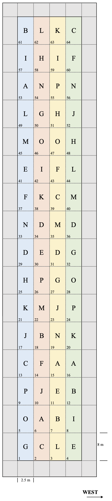

# The design of field experiments

## Suggestions to lay out proper field experiments

In order to lay-out a proper design and draw a correct map for a field experiment, it is necessary to consider the following items:

1. Length and width of the available space in the field
2. Sowing/working direction
3. Presence of fertility gradients of any kinds

Let's consider, for example, the experiment described in the Exercise 7 of Chapter 2. The text of such an Exercise is as follows: *You have been requested to design a breeding experiment with 16 wheat genotypes coded by using letters of the Roman alphabet. The aim is to determine which genotype is the best in a given environment. Write the experimental protocol, where you specify all the main elements of your project (subjects, variables, replicates, experimental design), and draw the field map. Consider a field measuring 400 m in length, 20 m in width and with the longer side aligned north-south. Sowing is carried out longitudinally, along the north-south axis, with a 2.5 m wide machine. The field is uniform along its longitudinal axis, although there is a significant transversal fertility gradient*.

How should we design such an experiment? I'll propose a stepwise solution (which is not at all the only possible solution!).

### Step 1

Let's start by projecting the size of a plot: wheat is to be regarded as a high-density crop (350-400 plants per square meter, in central Italy) and, thus, a plot of 20 m^2^ should be regarded as big enogh to obtain reliable yield data. Considering that the available sowing machine has a working width of 2.5 m, the most appropriate plot size should be 2.5 m in width and, consequently, 8 m in length.

### Step 2

Secondly, we should project the size of the grid. Considering that the field is usually worked and sown along its longitudinal axis and that it is relatively uniform along this axis, it would be appropriate to lay out the plot with its long side along the working direction. A 16 $\times$ 4 grid would be appropriate, with four 'vertical' blocks (one beside the other, along the fertility gradient), so that all the plots in one block are located in the very same position along the fertility gradient. Such a grid should fit with no problem in the available space. The surrounding space could be used to sow winter wheat, to avoid border effects along the edges of the experiment.

### Step 3

Allocate the genotypes to the plots, according to a Randomized Complete Block Design, so that there is one and only one replicate per genotype per block. In order to ease your mind, the package `agricolae` may provide significant help to randomised the genotypes and avoid errors (see code below). The final map could be as shown in the following Figure (the four blocks are in different colors). 

```{r}
library(agricolae)
des <- design.rcbd(LETTERS[1:16], r = 4, seed = 1234)
des$sketch
```


```{r Exercise27, echo=FALSE, out.width = "30%", fig.cap = "Randomised Complete Blocks Design (see Exercise 2.7)", fig.align='center'}

```


'agricolae'