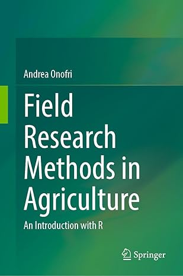

# Preface {.unnumbered}

This website is associated to the book 'Experimental methods in agriculture: an introduction with R', published by Springer Nature in 2025, which is a simple, 'non-mathematical' introduction to the experimental design and basic data analyses for field experiments in agriculture and related disciplines. It focuses on small-plot experiments, which are the fundamental foundations of scientific progress in agriculture. Indeed, these experiments are used to evaluate and compare, e.g., innovative genotypes, agronomic practices, pesticides and other plant protection methods. You can [visit the Springer publication website for the table of contents and sample chapters or to buy the whole book or any of its individual Chapters](https://link.springer.com/book/10.1007/978-3-032-08199-5).

This web sites hosts additional material, which might turn out useful either for teaching purposes, or for delving a little deeper in some topics. Additional R codes, slides and other information is also provided in my blog, that hosts this e-book.

## Statistical software {-}

In this website, as in the related book and hosting blog, datasets are analysed by using the R statistical software (R Core Team, 2024), within the RStudio environment (Posit team, 2024). Such choice was made for a number of reasons, including the fact that this language is very powerful and a lot of fun to work with.  I am very much indebted to the whole community, who is working to ensure the wide availability of these tools and preserve their freeware nature.

In order to work through this website, you will need to have installed R, RStudio and the following packages (in alphabetical order): `car` [@Fox_2019], `drc` [@ritz_2019], `emmeans` [@Lenth_2024],  `lme4` [@Bates_2015], `lmerTest` [@Kuznetsova_2017], `MASS` [@venables_2002],  `multcomp` [@Hotorn_2008], `multcompView` [@Graves_2024], `SuppDists` [@Wheeler_2025] and `statforbiology` [@Onofri_2025]. This latter is the accompanying R package for this website and the associated blog (see later). The readers should install these packages from CRAN, before starting to work through this book. The installation can be done by using the 'install packages' entry in the 'Tools' menu in R Studio.

It is also important to mention that this book and the associated website (see later) are written in RMarkdown [@Xie_2018] with the `bookdown` [@Xie_2024] and `blogdown` [@Xie_2017] packages; these are very useful and we feel very much indebted to the respective authors.

## Dedication {-}

This website is dedicated to the memory of my colleague and friend Dario Sacco (University of Torino, Italy). We started working together on a book project, and he was very eager to contribute to the first two Chapters in the earlier Italian version. Unfortunately, he had no luck and suddenly died far too early. This book is heavily based on the lengthy discussions we had during the statistics courses of the Italian Society of Agronomy, and the final result would have been much better if it had benefited from the continuing support and contributions from Dario.

## Acknowledgments {-}

I would like to thank my Colleagues at the Department of Agriculture, Food, and Environmental Sciences (University of Perugia, Italy): it has been a long road together, and I am happy we walked it together. In particular, I would like to thank Dino Alberati, Egidio Ciriciofolo, Gino Covarelli, Marcello Guiducci, Euro Pannacci, and Francesco Tei, from whom I have learned most of the subtleties of the research work.

This book and website owe much to the countless questions, confusions, and concerns shared by my students. In striving to support their learning journey, I found the motivation to write more clearly, think more deeply, and explain more simply.

Last but not least, I am deeply indebted to the R Core development team for the availability of the R language and environment, as well as for their efforts to maintain and preserve its freeware nature. I also want to mention that this book and its associated website are written in \texttt{RMarkdown}, using the \texttt{bookdown} and \texttt{blogdown} packages, which are three valuable additions to the R project, for which I am very much indebted.

## References
::: {#refs}
:::

